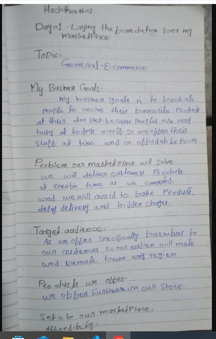
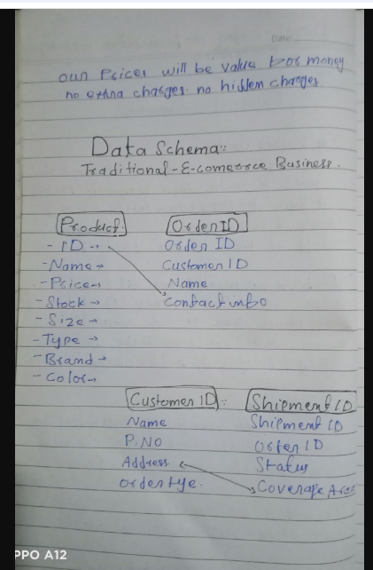
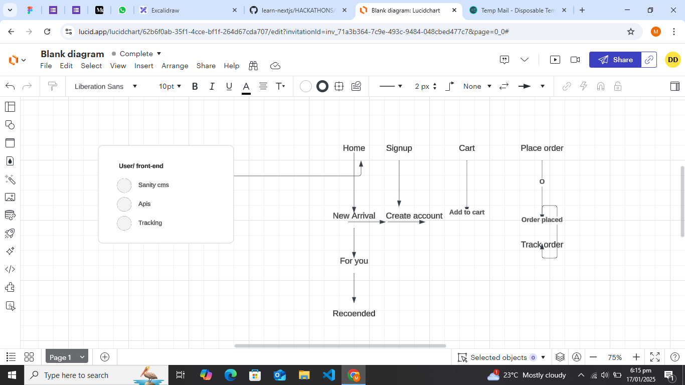
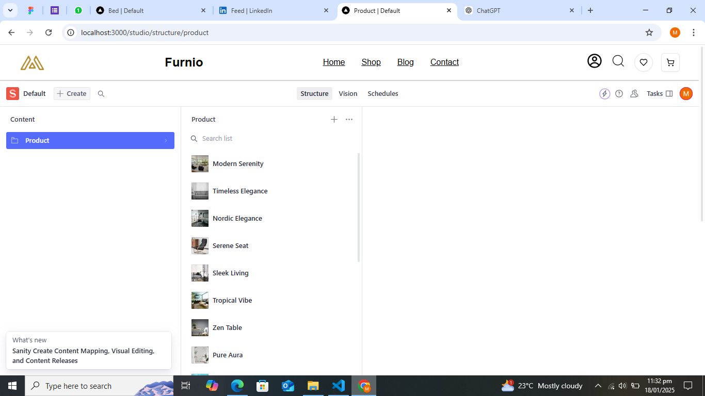
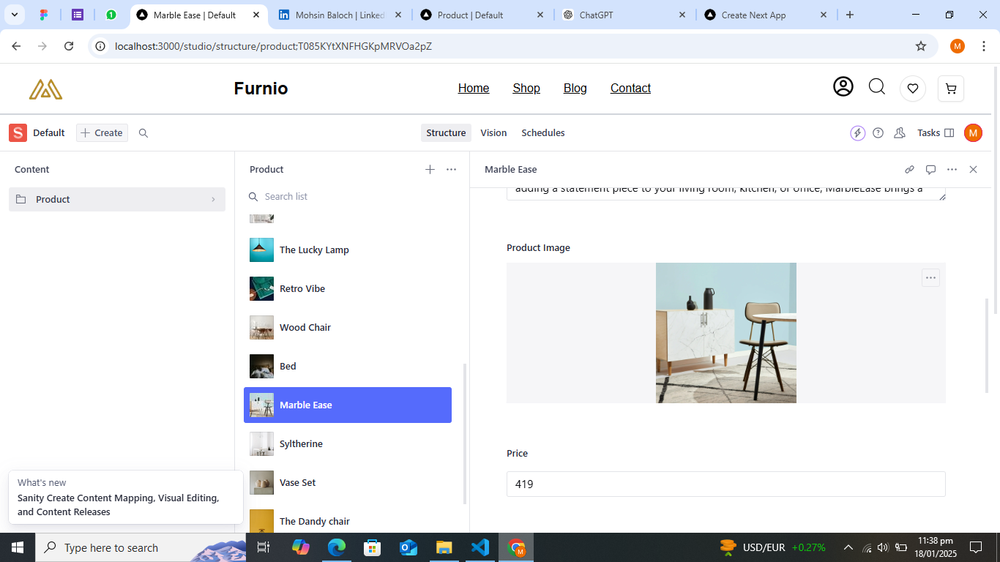
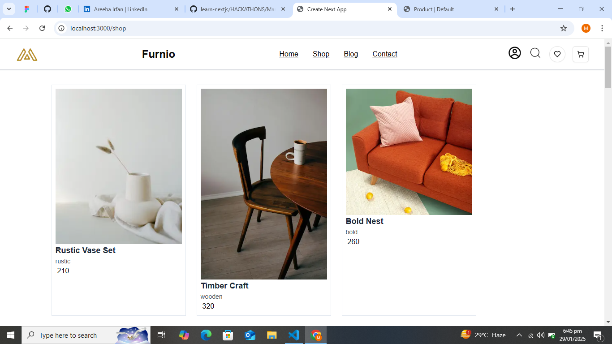
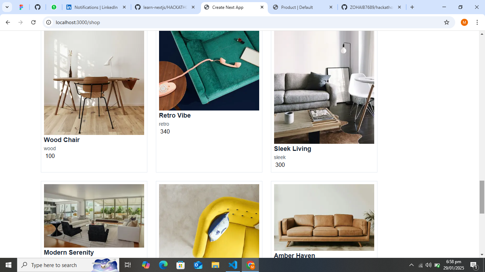
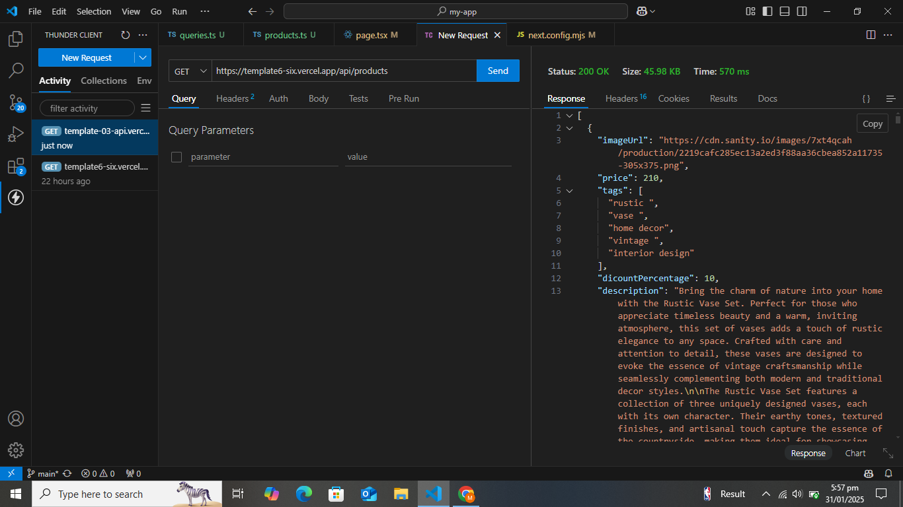
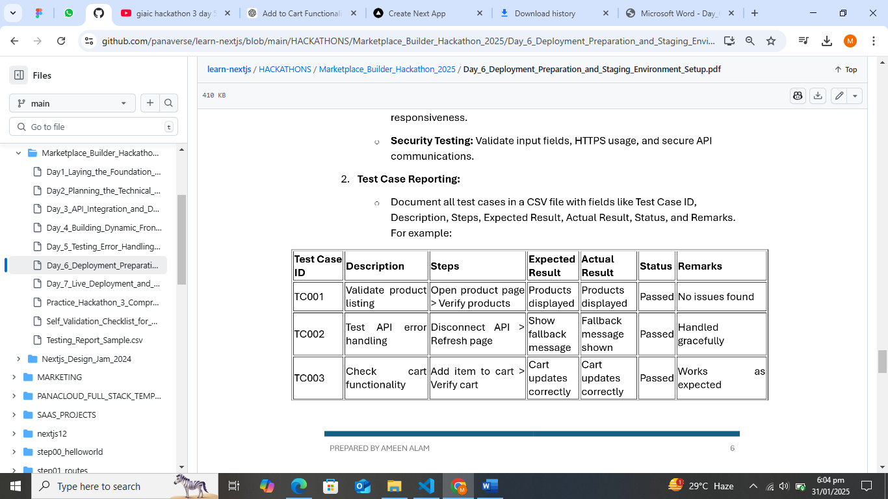

Hackthonday1 img 

1st day Images

 Hackathon Day 1: Building the Foundation for a Marketplace!

Today, I had the amazing opportunity to dive into the essentials of e-commerce platform as part of my hackathon task. 
We explored various types of marketplaces like E-commerce, Rental Commerce, and Q Commerce, gaining insights into their unique dynamics. After careful consideration, I chose to work on a Traditional E-commerce Platform.
 Key Features of My Platform:
1. Delivering high-quality products with transparency.
2. No hidden charges – ensuring complete trust for customers.
3. On-time delivery to provide a seamless shopping experience.
 Solving Customer Problems:
Offering reliable services.
Simplifying the shopping process.
Ensuring affordability without compromising on quality.
 To top it all off, I designed a project schema to visualize my platform's workflow and structure. This helped me solidify my ideas and create a strong foundation for the upcoming steps in the hackathon.
Excited to see where this journey takes me! Stay tuned for more updates. 

2nd Day Images

Day 02 of Marketplace Hackathon: Deep Dive into the Architecture! 
Today, I took a systematic approach to lay down the foundation of the marketplace project. It felt like I was designing a digital blueprint for a future-ready platform! 
 What I worked on today:
Mapped out the user journey : From signing up to browsing products, every user interaction has been meticulously planned.
Defined the database structure : Ensured the smooth storage of crucial data such as users, products, and orders.
Integrated Sanity CMS : The heart of managing dynamic content like product listings, categories, and real-time updates.
Crafted a seamless API flow : Designed to seamlessly connect the frontend, backend, and CMS for a smooth user experience.
Created a flow diagram : A visual representation to make the process easier to understand because visuals speak louder than words 
Main focus: Building a solid, scalable backend while keeping the admin panel intuitive and easy for efficient product management and updates.

3rd Day Images

DAY 3 - API INTEGRATION AND DATA MIGRATION
Today, successfully integrated API data into Sanity and migrated it to display seamlessly on a Next.js frontend.
This challenge was both exciting and rewarding, as it allowed me to refine my backend and frontend development skills. It was an incredible experience to see everything come together!

4th Day Images

Hackathon Day 4 - Building Dynamic Frontend Components for Marketplace
Another milestone achieved in the Hackathon! Day 4 was all about Dynamic Marketplace Development, where I focused on creating a responsive and scalable marketplace application.
1. Key Features Developed: Dynamic Product Listings – Products displayed in a grid layout with real-time updates.
2. Detailed Product Pages – Unique URLs, in-depth descriptions, and interactive filtering.
3. Category Filtering – Real-time search based on price, tags, and categories.
4. Checkout Process – Step-by-step billing, shipping, and payment flow.
 Takeaway: This project highlights the importance of modular design, scalability, and user experience in modern e-commerce applications. It has been an incredible learning experience!

5th Day Images

 Hackathon Day 5: Testing, Error Handling & Backend Optimization Completed!
Successfully completed Day 5 of the hackathon!  Today, I focused on refining my project by ensuring smooth performance, efficient error handling, and seamless backend integration.
1. Performance Optimization – Tested and improved site speed
2. Error Handling – Fixed bugs & enhanced user experience
3. Backend Refinement – Ensured smooth API responses & data flow
Every step brings me closer to a more robust and efficient project!  Excited for the next phase!

